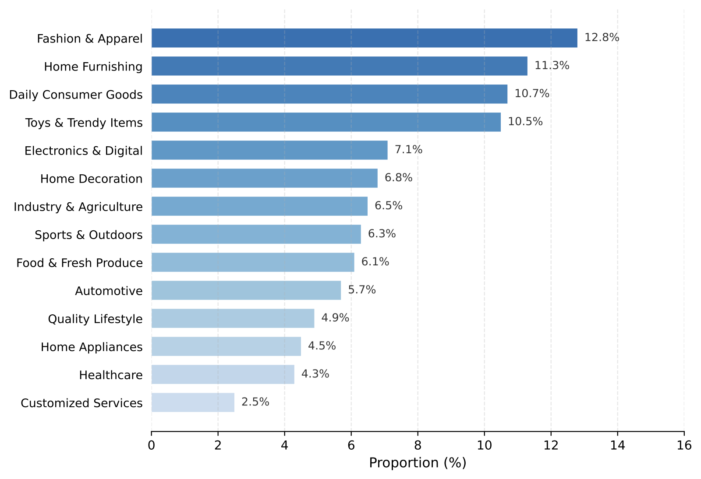
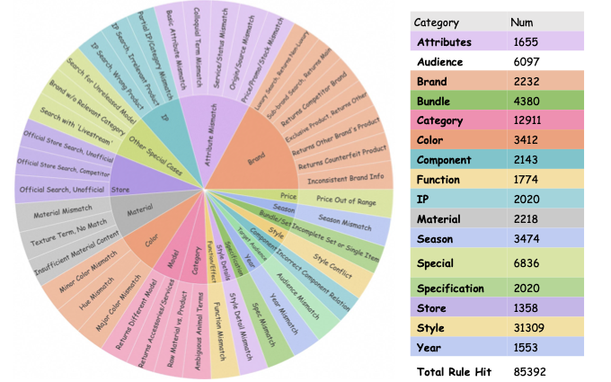

# RAIR Data Statistics and Distributions

This document provides the data distributions promised in the paper, covering label distribution, Hard Subset intent distribution, industry distribution of the General Subset, and the relevance rule taxonomy with its activation statistics.

> Note: statistics below refer to the full RAIR benchmark as reported in the paper (General 37,713 / Hard 10,931 / Visually Salient 5,895; 54,539 in total).

## 1. Ground-Truth Label Distribution

| Relevance | Label | Num | Frequency |
|---|---|---|---|
| Irrelevant | L1 | 12,360 | 22.7% |
| Irrelevant | L2 | 14,411 | 26.4% |
| Relevant | L3 | 12,871 | 23.6% |
| Relevant | L4 | 14,897 | 27.3% |

Binary split (Irrelevant vs. Relevant) is roughly 49:51.

## 2. Hard Subset: Distribution of Challenging Query Intents

| Category | Sub-Intent | Num | Freq. |
|---|---|---|---|
| Knowledge-Dependent | Domain Jargon (DJ) | 1,838 | 16.8% |
| Knowledge-Dependent | Entity Relationship (ER) | 713 | 6.5% |
| Reasoning-Dependent | Solution Seeking (SS) | 1,992 | 18.2% |
| Reasoning-Dependent | Question Answering (QA) | 744 | 6.8% |
| Reasoning-Dependent | Negative Constraints (NC) | 1,073 | 9.8% |
| Multi-Attribute | Multi-Attribute (MA) | 4,571 | 41.8% |

## 3. Industry Distribution of the General Subset

The General Subset maintains a controlled industry balance via stratified sampling: the largest category is capped at 12.8%, preventing evaluation bias toward head categories.

| Industry | Proportion |
|---|---|
| Fashion & Apparel | 12.8% |
| Home Furnishing | 11.3% |
| Daily Consumer Goods | 10.7% |
| Toys & Trendy Items | 10.5% |
| Electronics & Digital | 7.1% |
| Home Decoration | 6.8% |
| Industry & Agriculture | 6.5% |
| Sports & Outdoors | 6.3% |
| Food & Fresh Produce | 6.1% |
| Automotive | 5.7% |
| Quality Lifestyle | 4.9% |
| Home Appliances | 4.5% |
| Healthcare | 4.3% |
| Customized Services | 2.5% |

## 4. Relevance Rule Framework and Rule Activation Distribution

The sunburst chart (left) shows the hierarchical rule taxonomy: each of the 16 intent dimensions branches into fine-grained discriminative rules (e.g., *Brand* splits into "Competitor Brand", "Sub-brand", "Counterfeit Product"). The table (right) reports rule activations across the dataset:

| Dimension | Rule Hits |
|---|---|
| Style | 31,309 |
| Category | 12,911 |
| Special | 6,836 |
| Audience | 6,097 |
| Bundle | 4,380 |
| Season | 3,474 |
| Color | 3,412 |
| Brand | 2,232 |
| Material | 2,218 |
| Component | 2,143 |
| IP | 2,020 |
| Specification | 2,020 |
| Function | 1,774 |
| Attributes | 1,655 |
| Year | 1,553 |
| Store | 1,358 |
| **Total** | **85,392** |

## 5. Definitions of the 16 Intent Dimensions

| Dimension | Definition |
|---|---|
| Category | The primary classification of the good (e.g., dress, smartphone). |
| Style | Aesthetic style or visual design (e.g., vintage, Korean-style, thickened). |
| Special | Special queries involving abstract needs, promotions, or new arrivals. |
| Audience | Target demographics, including gender and age group (e.g., for kids, men). |
| Bundle | Constraints on set completeness or quantity (e.g., suit vs. single jacket). |
| Season | Applicable time or season of use (e.g., summer, winter thermal). |
| Color | Visual color attributes (e.g., red, navy blue). |
| Brand | Specific brand requirements (e.g., Nike, Apple). |
| Material | Composition material of the product (e.g., cotton, leather). |
| Component | Relationship between the main product and accessories/parts. |
| Specification | Technical parameters (e.g., size, weight, capacity). |
| IP | Intellectual Property rights or character associations (e.g., Disney, Marvel). |
| Function | Specific efficacy or usage scenarios (e.g., whitening, gaming). |
| Attributes | Other specific product properties not covered above (e.g., second-hand, origin). |
| Year | Specific model year or vintage (e.g., 2023 version). |
| Store | Constraints on the seller or channel (e.g., official flagship store). |
